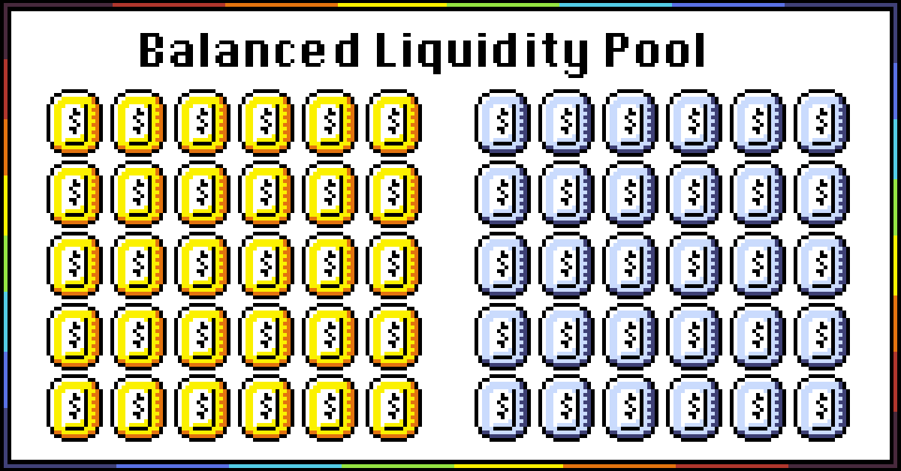
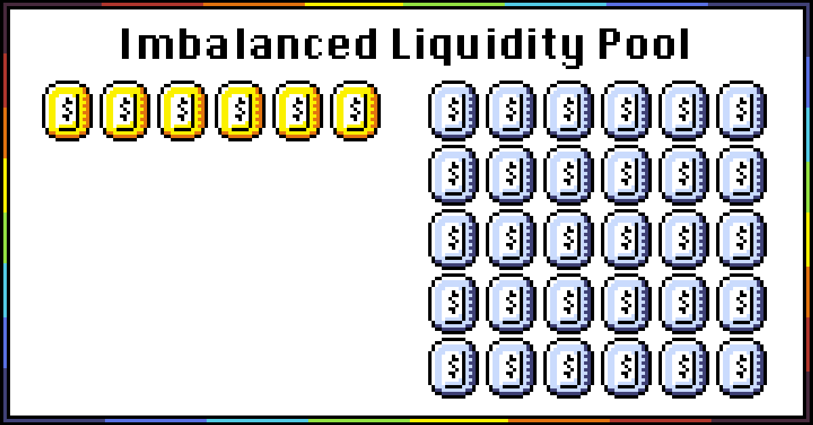
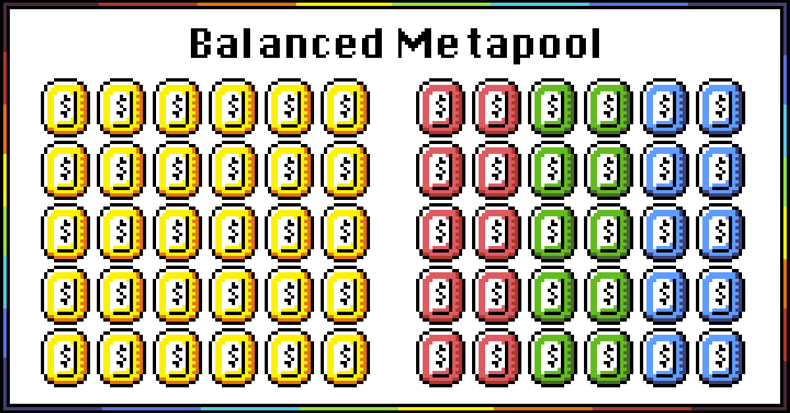
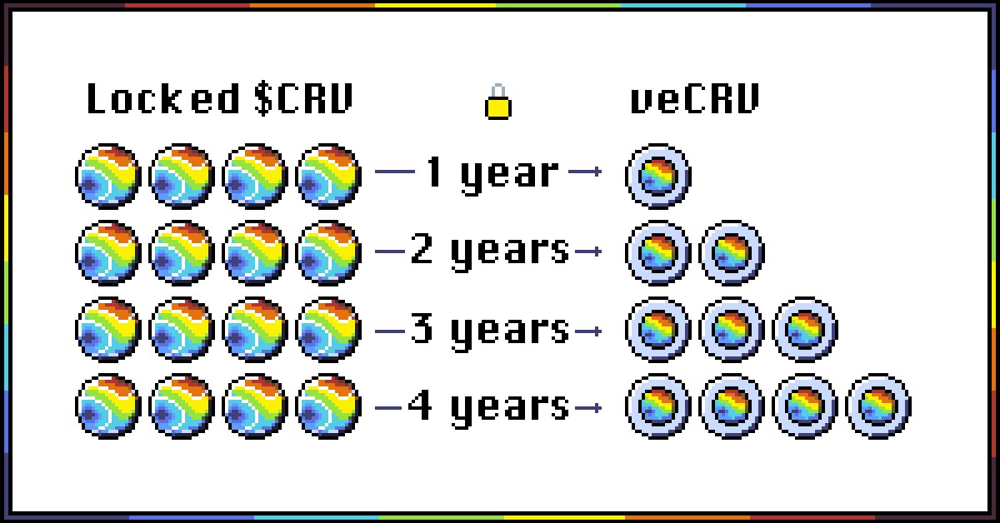

.. _curve-overview:

==================
Curve: Overview
==================

This document provides an overview of Curve aimed at a technical audience.  This document assumes a basic familiarity with the Ethereum blockchain and smart contracts.  We will introduce the major concepts of Curve with a focus on the technical specifications.

If you are not technical we recommend visiting the `Curve Documentation <https://resources.curve.fi/>`_.  Throughout this document, references to fungible tokens that bear value are prefixed with a dollar sign, (ie $USDT)

Curve Liquidity Pools
=====================

Curve maintains several dozen non-custodial **liquidity pools**.  Each liquidity pool is an Ethereum smart contract that accepts deposits in two or more denominations of tokens.  The tokens in most liquidity pools are expected to maintain pegs to specific asset prices.  For example, exchanging a $USDT dollarcoin for one $USDC dollarcoin will be an equal exchange of value if both tokens maintain a 1:1 peg to the US Dollar.

**Liquidity providers** are users who deposit tokens into a Curve liquidity pool.  Liquidity providers who deposit *n* number of tokens of one denomination are permitted to withdraw this value worth of tokens of any denomination from the pool.

For example,depositing 1000 $USDT into the `Y Pool <https://www.curve.fi/3pool>`_ would permit the user to withdraw 1000 of any of the three denominations the pool accepts, `$USDT <https://etherscan.io/address/0xdAC17F958D2ee523a2206206994597C13D831ec7>`_, `$USDC <https://etherscan.io/address/0xA0b86991c6218b36c1d19D4a2e9Eb0cE3606eB48>`_, and `$DAI <https://etherscan.io/address/0x6B175474E89094C44Da98b954EedeAC495271d0F>`_.  The actual amount may be slightly less than 1000 due to price discrepancies and fees, discussed later.

Each liquidity pool is considered to be **"balanced"** if it contains a balance of tokens in similar proportion.  For a balanced pool, the exchange rate among tokens will be 1:1.

*Figure 1: Balanced Liquidity Pool*

If a massive run occurs on one of the tokens in the pool, the pool becomes **imbalanced**.  The imbalance may be caused by random factors, or it could be imbalanced because a token's value has temporarily or permanently depegged.

*Figure 2: Imbalanced Liquidity Pool*

Curve liquidity pools serve as a **Automated Market Maker (AMM)**.   When the pool is imbalanced, the AMM will automatically adjust the **relative price** of each token based on the current supply.  A token that is scarce (higher relative price) will be more costly to withdraw than the token that is abundant.  Similarly, depositing a scarce token will provide liquidity providers a greater share of the pool on deposit.

Curve is unique among liquidity pools in that its AMM uses a formula that combines a linear invariant and a constant-product invariant that provides more stability when the peg is close to 1:1, but adjusts asymptotically at extreme price fluctuations.  If you are interested in learning more on this subject, consult the `Curve White Paper <https://www.curve.fi/stableswap-paper.pdf>`_.

A listing of all active pools is maintained in the registry.  The full technical details of the registry are `described here <registry-overview.rst>`_.

Metapools
=====================
Several Curve liquidity pools are referred to as **Metapools**.  Metapools are liquidity pools that trade between one token and another liquidity pool.  The underlying pool of a metapool is referred to as a **base pool**.  Within a metapool, users can trade directly between tokens in the metapool and the base pool.

*Figure 3: Balanced Metapool*

For example, in the GUSD metapool [$GUSD, [3Pool]], users can trade between GUSD and the tokens in 3Pool ($DAI, $USDC, $USDT) allowing for four total tokens.

Popular base pools include:

- `3Pool (dollar) <https://curve.fi/3pool>`_: Contains `$DAI <https://etherscan.io/address/0x6B175474E89094C44Da98b954EedeAC495271d0F>`_, `$USDC <https://etherscan.io/address/0xA0b86991c6218b36c1d19D4a2e9Eb0cE3606eB48>`_, and `$USDT <https://etherscan.io/address/0xdAC17F958D2ee523a2206206994597C13D831ec7>`_
- `sBTC (bitcoin) <https://curve.fi/sbtc>`_: Contains `$renBTC <https://etherscan.io/address/0xEB4C2781e4ebA804CE9a9803C67d0893436bB27D>`_, `$wBTC <https://etherscan.io/address/0x2260FAC5E5542a773Aa44fBCfeDf7C193bc2C599>`_, and `$sBTC <https://etherscan.io/address/0xfE18be6b3Bd88A2D2A7f928d00292E7a9963CfC6>`_

$CRV, veCRV and Fee Distribution
==========================================
The `$CRV token <https://etherscan.io/token/0xD533a949740bb3306d119CC777fa900bA034cd52>`_ is the governance token for activity around the Curve site.  There will be a total of 3.03 billion $CRV.  The release schedule and further details are described on the `Curve Tokenomics page <https://resources.curve.fi/base-features/understanding-tokenomics>`_.

The primary action that can be taken with $CRV is to *stake* it and receive a variable amount of **vote escrowed CRV (veCRV)**.  Staking will lock $CRV for a time period from one week to four years, and the user will receive a credit of veCRV.  The credit of veCRV declines over time at a set rate, presented at the time of locking.  Users can stake Curve at the `locker <https://dao.curve.fi/locker>`_.

The amount of veCRV initially received upon staking $CRV depends on the length of the time lock.  One $CRV locked for one year yields 0.25 veCRV, while one $CRV locked for four years receives one veCRV.  veCRV has no value and cannot be transferred.

*Figure 4: $CRV Locking*

Curve levies a 0.04% fee on all exchanges within Curve liquidity pools.  Half of these fees are distributed to liquidity providers, the rate of which is displayed on the Curve homepage as the pool's APY.  The other half of these fees are distributed to veCRV holders in the form of more $CRV which can be claimed on the Curve homepage.  Fees are distributed every Thursday.  Users who lock $CRV must wait 8 days from the Thursday after the first lock before it can be claimed.

Another value of locking $CRV to receive veCRV is the ability to boost the reward for liquidity providers.  The homepage lists the CRV reward as +x% to y% CRV -- the y% refers to the maximum possible boost.  The **gauges** are contracts that govern these boosts.  Each gauge has a different requirement for obtaining this boost.  The boost requirement can be calculated using the `calculator <https://dao.curve.fi/minter/calc>`_, and current gauge information `exists here <https://dao.curve.fi/minter/gauges>`_.  Additional information about boosting is `located here <https://resources.curve.fi/guides/boosting-your-crv-rewards>`_.

veCRV also has utility on the Curve `governance forum <https://gov.curve.fi>`_.  Additional information about governance exists `here <https://resources.curve.fi/base-features/understanding-voting>`_.

.. image:: https://gblobscdn.gitbook.com/assets%2F-MFA0rQI3SzfbVFgp3Ic%2F-MT5dNbeDEngQ7_tEymQ%2F-MT5dRWFpub2GezqLodd%2Fimage.png?alt=media&token=23e9f550-db0c-4357-a317-a6f21a36eb58

*Figure 5: Matrix of Curve rewards structure*

Cross Asset Swaps
=====================
In 2021, Curve introduced the capability to swap between two different assets.  The feature is [documented here](/cross-asset-swaps.rst).

Public Functions
=====================
All Curve liquidity pools are smart contracts that contain the following public functions:

----------------

**Mutative Functions**

----------------

``add_liquidity(amount, min_mint_amount)``

*Deposits funds into the liquidity pool*

- amounts *uint256[n]*: Amount of tokens (n == number of denominations in pool)
- min_mint_amount *uint256*: Minimum acceptable mint to protect against slippage

----------------

``remove_liquidity(_amount, min_amounts)``

*Withdraw funds proportionally from the liquidity pool.  Logs a RemoveLiquidity event*

- _amount *uint256*: Amount of tokens
- min_amounts *uint256[n]*: Revert if less than acceptable amount, to protect against slippage

----------------

    remove_liquidity_imbalance(amounts, max_burn_amount)

*Withdraw funds disproportionately from the liquidity pool.  Logs a RemoveLiquidity event*

- amounts *uint256[n]*: Balances to withdraw from each denomination
- max_burn_amount *uint256*: Revert if token amount is greater than this value, to protect against slippage

----------------

``remove_liquidity_one_coin(_token_amount, i, min_amount)``

*Withdraw _token_amount liquidity in the form of coin i.  Logs a RemoveLiquidityOne event*

- _token_amount *uint256*: Amount of liquidity to remove
- i *uint256*: Index of coin to withdraw
- min_amount *uint256*: Revert token amount is less than this value, to protect against slippage

----------------

``exchange(i, j, dx, min_dy)``

*Exchange dx number of i coins for j coins without providing liquidity.  Logs a TokenExchange event*

- i *uint256*: Index of first coin
- j *uint256*: Index of second coin
- dx *uint256*: Amount of coins to exchange
- min_dy *uint256*: Revert if transaction is less than this value

----------------

**Non-Mutatative Views**

----------------

``calc_token_amount(amounts, deposit)``

*Simple method for calculating change in token supply on deposit or withdrawal.  Does not consider fees, so not useful for precise calculations.*

- amounts *uint256[n]*: Number of coins deposited or withdrawn
- deposit *bool*: True if deposit, False if withdrawal
- returns *uint256*: Calculated token amount

----------------

``get_virtual_price()``

*Returns portfolio virtual price (for calculating profit)*

- returns *uint256*: Price, scaled by 1e18

----------------

``get_dy(i, j, dx)``

*Returns the number of j coins received for exchanging dx number of i coins in c-units*

- i *uint256*: index of first coin
- j *uint256*: index of second coin
- dx *uint256*: amount of coins to exchange
- returns: number of coins received (after fee)

----------------

``get_dy_underlying(i, j, dx)``

*Returns the number of j coins received for exchanging dx number of i coins in underlying units*

- i *uint256*: index of first coin
- j *uint256*: index of second coin
- dx *uint256*: amount of coins to exchange
- returns: number of coins received (after fee)

Owner Functions
=====================
The following functions exist only for the deployer of the contract.  They are not documented in full detail here, but provided for further understanding of the capabilities reserved for pool admins.

- **ramp_A:** Create a linear ramp to adjust the **"Amplification" parameter (A)**, as described in the white paper.  Logs a RampA event.
- **stop_ramp_A:** End an active ramp and sets the value of A at the current value.  Logs a StopRampA event.
- **commit_new_fee:** Set a new admin fee to take effect after a future time for the pool.  Logs a CommitNewFee event.
- **apply_new_fee:** Immediately begin the new fee.  Logs a NewFee event.
- **commit_transfer_ownership:** Assign a new admin to take over the contract at a future date.  Logs a CommitNewAdmin event.
- **apply_transfer_ownership:** Execute the transfer of ownership of the contract.  Logs a NewAdmin event.
- **revert_new_parameters:** Revert a new fee
- **revert_transfer_ownership:** Revert an ownership transfer
- **withdraw_admin_fees:** Transfer admin fees to the admin
- **kill_me:** Halt the contract
- **unkill_me:** Revive the contract

